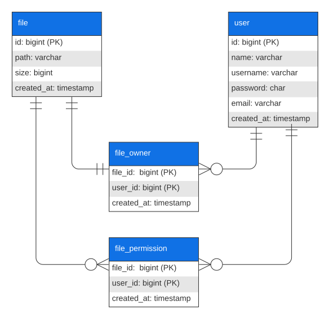

# File Sharing Application

## Decisiones para los casos de uso

- Autenticación mediante JWT.
- Se utiliza un único bucket para almacenar todos los archivos ya que la cantidad de archivos que soporta es ilimitada.
- Se hace un prepend del id del usuario al archivo a modo de carpeta personal para evitar colisiones entre los archivos.
- Se guarda el tamaño del archivo sin truncar.
- Paginación para el listado de archivos, ya que puede ser arbitrariamente grande.
- Un usuario debe ser el propietario del archivo para poder compartirlo.
- Un usuario no puede asignar permisos a sí mismo.

## Base de datos

Se optó por un esquema relacional.



## Arquitectura


La arquitectura de la api es de tipo limpia. Hacia el centro se encuentran las abstracciones y reglas de negocio (policies). Hacia el exterior se encuentran los detalles/implementaciones.
Además una capa interna no puede referenciar una capa externa. Este tipo de arquitectura permite cambiar la implementación de los detalles sin afectar las reglas de negocio.
Los casos de uso y repositorios adhieren a single responsibility principle.

El punto de entrada de la aplicación es `main`.

También se identifican 3 contextos principales:
- **authentication**: relacionado al manejo de usuarios (signup y signin).
- **file-management**: relacionado al manejo de archivos (altas, listado y eliminaciones).
- **file-sharing**: relacionado al manejo de permisos sobre los archivos.

## Pasos para levantar la API

- Correr tests
```bash
$ npm run test
```

- Probar el proyecto localmente con Docker.
```bash
$ docker-compose up
```

- Para ejecutar la API sin Docker:

Asegurar que el archivo `.env` tenga las credenciales correspondientes para los servicios.

Además se debe aplicar el esquema contenido en `src/main/config/db/shema.sql` al servidor MySQL.

Luego para levantar la API ejecutar:

```bash
$ cd file-sharing-application

# Instalar dependencias
$ npm i

# Compilar el proyecto
$ npm run build

# Iniciar el servidor
$ npm run start
```

## Pruebas manuales sobre la API

Se incluyen dos colecciones de Postman:
- `file-sharing-system-authentication.postman_collection.json`: Incluye los endpoints de autenticación.
- `file-sharing-system.postman_collection.json`: Incluye los endpoints de la aplicación que requieren autenticación.
